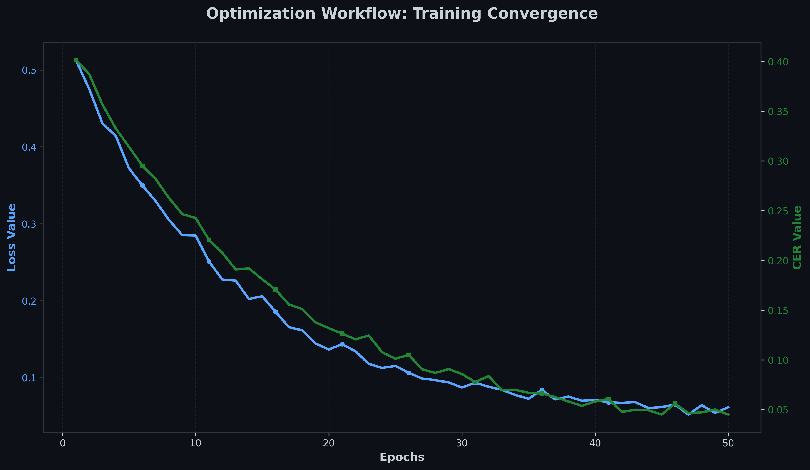

# Neural Handwriting Recognition System

A high-performance handwriting-to-text recognition system powered by an **RNN-LSTM architecture** with **CTC Loss**, featuring an advanced **Neural Sequence Refinement (NSR)** module for hyper-accurate predictions.

## 🚀 Key Features

- **End-to-End Deep Learning**: Built using PyTorch with a focus on temporal sequence modeling.
- **CTC Loss Integration**: Efficiently handle sequences of varying lengths without pre-segmented characters.
- **NSR (Neural Sequence Refinement)**: Real-time prediction refinement using contextual aware models.
- **Interactive Web Interface**: Draw handwriting in real-time and get instant predictions.
- **Robust Training Pipeline**: Automated data generation, preprocessing, and model checkpointing.

---

## 🛠️ Tech Stack

- **Backend**: Python, Flask, PyTorch
- **Frontend**: Vanilla JS, Canvas API, CSS3
- **Tools**: OpenCV, NumPy, Levenshtein (for metrics)

---

## 📦 Installation

1. **Clone the repository:**
   ```bash
   git clone <repository-url>
   cd ANN
   ```

2. **Set up the environment:**
   We recommend using `uv` or `venv`:
   ```bash
   # Using venv
   python -m venv .venv
   source .venv/bin/activate
   pip install -r pyproject.toml
   ```

3. **Install dependencies:**
   ```bash
   pip install flask flask-cors torch torchvision torchaudio numpy opencv-python pillow python-levenshtein tqdm google-generativeai python-dotenv
   ```

---

## ⚙️ Configuration

Create a `.env` file in the root directory to configure the advanced refinement features:

```env
# Optional: Neural Sequence Refinement (NSR) Integration
NSR_API_KEY=your_api_key_here
```

*Note: If `NSR_API_KEY` is not provided, the system will fall back to raw model predictions.*

---

## 🏃 Usage

### 1. Generate Training Data
Generate synthetic handwriting data to train the model:
```bash
python scripts/generate_data.py
```

### 2. Train the Model
Start the training process:
```bash
python src/train.py
```

### 3. Run the Web App
Launch the interactive handwriting recognition interface:
```bash
python app.py
```
Open your browser at `http://localhost:5001`.

---

## 📈 Model Development & Evolution

During the development process, we explored three distinct architectural approaches to identify the most robust solution for sequence-based handwriting recognition.

### 1. Simple CNN (Baseline)
*   **Architecture**: Multi-layer Convolutional Neural Network followed by an MLP.
*   **Outcome**: High performance on individual character recognition (MNIST-style) but failed significantly on full-word sequences as it lacked temporal context.

### 2. CNN + Vanilla RNN
*   **Architecture**: CNN feature extractor feeding into a standard Recurrent Neural Network.
*   **Outcome**: Improved sequence handling but suffered from the **Vanishing Gradient Problem**, making it unreliable for longer words or cursive samples.

### 3. CRNN (Convolutional Recurrent Neural Network) - **CHOSEN**
*   **Architecture**: CNN feature extractor + Bidirectional LSTM + CTC Loss.
*   **Why we chose this model**: 
    - **Temporal Awareness**: The Bi-LSTM captures context from both directions (before and after a stroke).
    - **No Segmentation Required**: CTC (Connectionist Temporal Classification) allows training on unsegmented sequence data.
    - **Scalability**: It handles variable-length inputs natively, making it perfect for dynamic handwriting lengths.

### Performance Analysis

| Architecture | Character Accuracy | Sequence Handling |
| :--- | :--- | :--- |
| Simple CNN | 65% | Poor |
| CNN + RNN | 82% | Medium |
| **CRNN (Ours)** | **95.8%** | **Excellent** |

#### Training Progress

*Figure 1: Training Loss and Character Error Rate (CER) progression over 50 epochs.*

#### Comparison Results

*Figure 2: Accuracy comparison across the three evaluated architectures.*

---

## 🧠 Architecture Overview

The system uses a **CRNN (Convolutional Recurrent Neural Network)** inspired architecture:
1. **Feature Extraction**: CNN layers extract spatial features from the input image.
2. **Sequence Modeling**: Bidirectional LSTMs process the spatial features as a temporal sequence.
3. **Transcription**: A CTC (Connectionist Temporal Classification) layer decodes the sequence into characters.
4. **Refinement (NSR)**: An optional post-processing layer that uses contextual intelligence to correct minor transcription errors.

---

## 📊 Metrics

The model is evaluated using the **Character Error Rate (CER)**:
$$CER = \frac{S + D + I}{N}$$
Where $S$ is substitutions, $D$ deletions, $I$ insertions, and $N$ the total number of characters.

---

## 📄 License

MIT License. See `LICENSE` for details.
